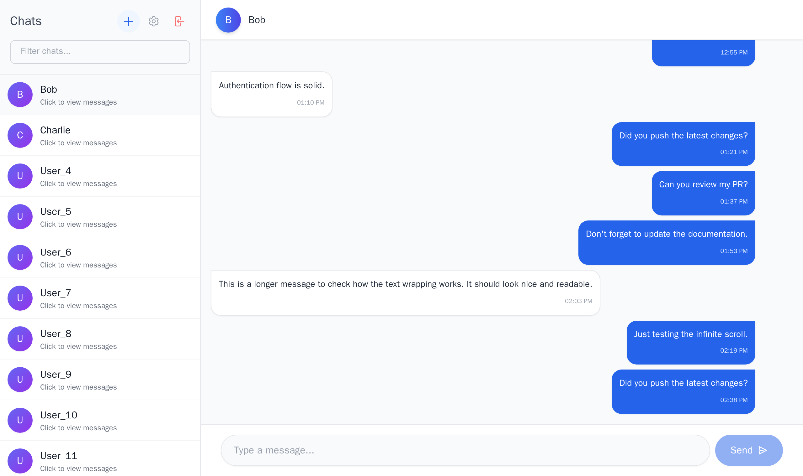

# Flask-React Messenger

[](https://github.com/OlehDzhumyk/flask-react-messenger/actions/workflows/ci.yml)

A self-hosted one-to-one messenger: a REST API in Flask with PostgreSQL, and a single-page React client.
Users can register, start chats by email, send, edit and delete messages, scroll back through history,
and delete their account without breaking the conversation for the other person.



## Features

- **Accounts** — registration and login with JWT; passwords stored as salted Werkzeug (scrypt) hashes.
- **Chats** — start a conversation by entering someone's exact email; opening an existing pair returns the same chat.
- **Messages** — send, edit and delete your own messages. Only chat participants can read a chat,
  and only the author can change a message (`403` otherwise).
- **History** — loads the latest 50 messages, then older pages as you scroll up, keeping the scroll position.
- **Near real-time updates** — the client asks only for messages newer than the last one it has, every 3 seconds.
- **Account deletion** — removes the user; their messages stay in the partner's history under "Deleted Account".
- **API docs** — interactive Swagger UI generated from the endpoint docstrings.

## Tech stack

| Layer | Technologies |
| :--- | :--- |
| Backend | Python 3.11, Flask (app factory + blueprints), Flask-SQLAlchemy, Flask-JWT-Extended, Flasgger |
| Database | PostgreSQL 15 (SQLite in-memory for tests) |
| Frontend | React 18, Vite, Tailwind CSS, React Router, Axios, Formik + Yup |
| Tooling | Docker Compose, pytest, ESLint, GitHub Actions |

## Design decisions

**Polling instead of WebSockets.** New messages are fetched with `GET /api/chats/<id>/messages?after_id=<last id>`,
so each poll returns only the delta (usually nothing). This keeps the API stateless and simple to deploy and test.
The trade-off is up to 3 s of latency and some idle requests; moving to WebSockets is the next step (see below).

**Cursor-based pagination.** History uses `before_id` rather than page numbers. Offsets shift when new messages
arrive, and cursors don't, so you never see a message twice or skip one while scrolling.

**No user enumeration.** `GET /api/users` only matches an exact email. You can't list or search users by partial
name, so the API doesn't leak who has an account.

**Deleting an account keeps your partner's history.** The author foreign key on messages is nullable
(`ON DELETE SET NULL`), so when a user is deleted their identity is removed but the conversation still makes
sense to the other participant.

## Running locally

Requirements: Docker with Docker Compose.

```bash
git clone https://github.com/OlehDzhumyk/flask-react-messenger.git
cd flask-react-messenger
cp backend/.env.example .env        # Compose reads variables from the project root
docker compose up --build
```

In a second terminal, load demo users and conversations:

```bash
docker compose exec backend flask seed_db
```

| | URL |
| :--- | :--- |
| App | http://localhost:3000 |
| Swagger UI | http://localhost:5000/apidocs |

Log in as `alice@test.com`, `bob@test.com` or `charlie@test.com` — the password for all demo users is `password`.

> **macOS:** port 5000 is taken by AirPlay Receiver. If the backend fails with "address already in use",
> turn it off in *System Settings → General → AirDrop & Handoff*.

## Tests

The backend has 27 pytest tests covering auth, access control, pagination and polling, message editing,
account deletion and error handling. They use an in-memory SQLite database, so they run without Postgres:

```bash
docker compose exec backend pytest          # with the stack running
# or locally
cd backend && pip install -r requirements.txt && pytest
```

GitHub Actions runs the tests with a coverage report and lints and builds the frontend on every push
and pull request to `main` and `develop`.

## API

All endpoints except register and login need an `Authorization: Bearer <token>` header.

| Method | Endpoint | Description |
| :--- | :--- | :--- |
| `POST` | `/api/auth/register` | Create an account |
| `POST` | `/api/auth/login` | Log in and receive a JWT |
| `GET` | `/api/users?q=<email>` | Find a user by exact email |
| `GET` `PUT` `DELETE` | `/api/profile` | View, update or delete your account |
| `GET` `POST` | `/api/chats` | List your chats / start a chat |
| `GET` | `/api/chats/<id>/messages` | History; supports `limit`, `before_id`, `after_id` |
| `POST` | `/api/chats/<id>/messages` | Send a message |
| `PUT` `DELETE` | `/api/messages/<id>` | Edit or delete your message |

Request and response details are in Swagger UI and [docs/API_DESIGN.md](docs/API_DESIGN.md).

## Project structure

```
backend/
  app.py            app factory, config, Swagger setup
  auth.py           register / login
  chat.py           chats and messages
  users.py          user search and profile
  models.py         User, Chat, Message (+ participants table)
  commands.py       `flask seed_db`
  tests/
frontend/src/
  pages/            Login, Register, Dashboard
  components/       chat window, sidebar, modals
  context/          auth state and user cache
  services/         Axios API client
```

## Limitations and next steps

- Replace polling with WebSockets (Flask-SocketIO) for instant delivery and typing indicators.
- The API URL is hard-coded to `localhost:5000` in the client; it should come from build-time config.
- There are no frontend tests yet.
- One-to-one chats only; the data model (a participants table) already allows group chats.
